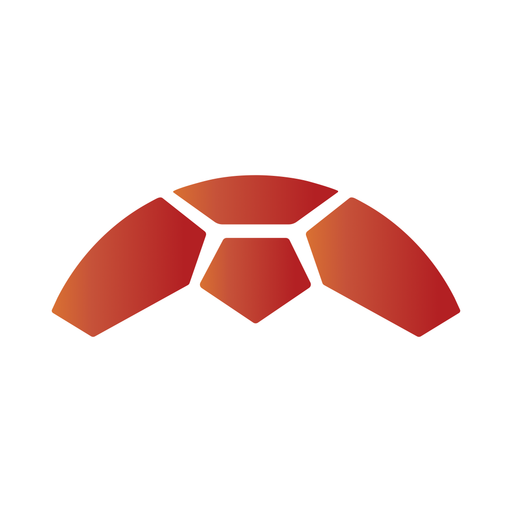

  

<h1 align="center">Resetrix</h1>

<em>Re-think. Re-work. Re-focus.</em>

<a href="https://resetrix.com">resetrix.com</a>

## Who we are

Resetrix is an SME-focused software studio. Our name embodies our approach: **"Reset"** reflects our commitment to starting from scratch and helping SMEs rebuild their systems, customising every part of the software to their specific needs; **"Trix"**, derived from "Matrix", reflects our belief in collaboration and flexibility — like a matrix, we thrive on teamwork, where success is achieved through strong partnerships with our clients.

## Mission

To empower SMEs by guiding them through digital transformation with expert support — driving innovation, growth, and success for our clients, believing that by helping them succeed, we succeed together.

## Vision

To be a trusted partner for SMEs, delivering scalable, high-quality software solutions that grow with their businesses. Through innovation and continuous learning, we stay at the forefront of technology, fostering long-term, transparent partnerships based on trust and collaboration.

## Services

- **Digital Transformation** — guiding SMEs from traditional business models to efficient, modern digital operations.
- **Software Customization** — end-to-end custom software built to fit your exact business model.
- **Digital Consultancy** — roadmapping your post-transformation journey, from scaling to integrating new technologies.
- **Responsive Support** — fast, reliable support that responds to all client queries within one hour.
